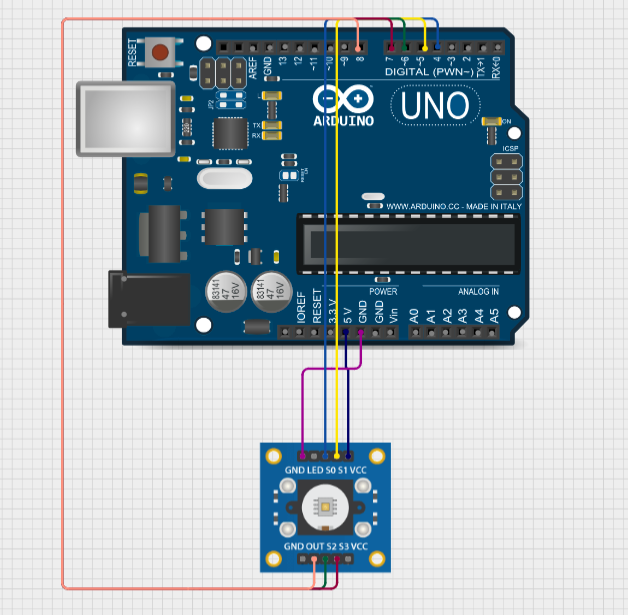
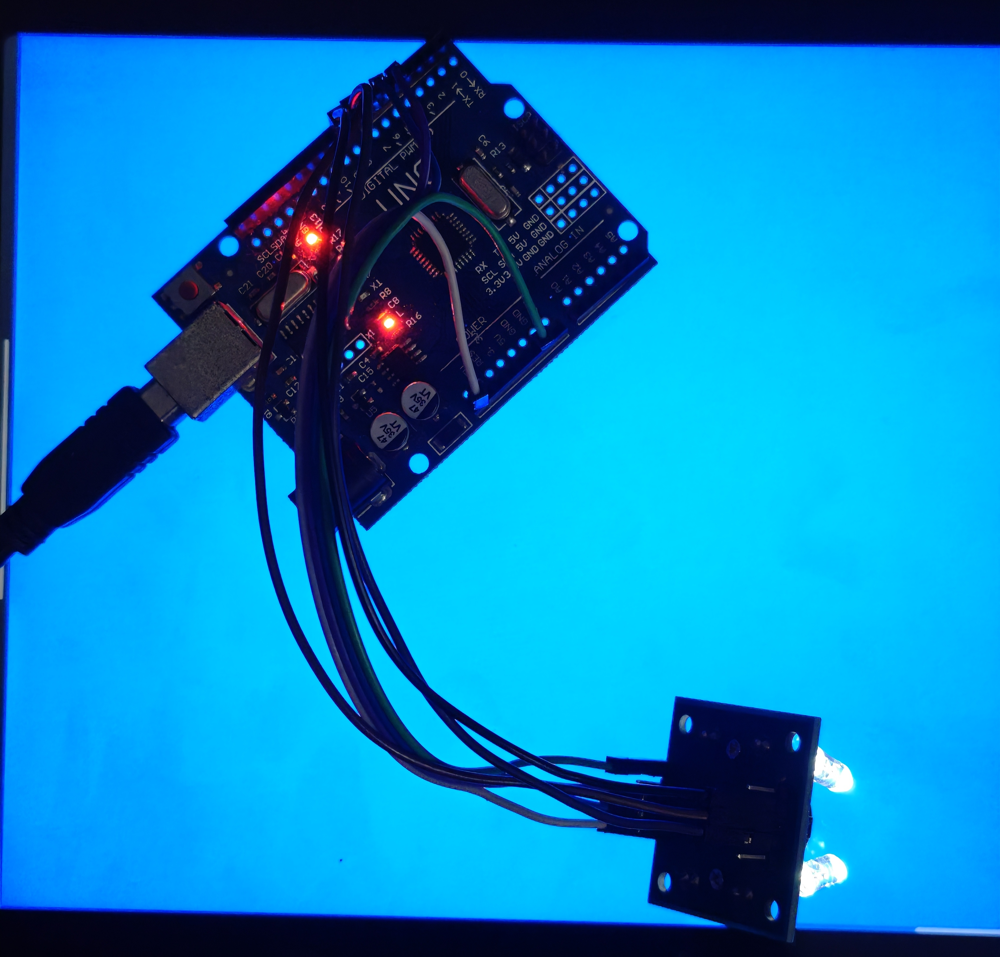
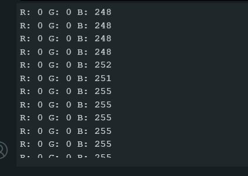

# Arduino Color Sorter  

This project uses an **Arduino Uno** and an **HW-531 (TCS3200) color sensor** to detect colors.  
The sensor measures the reflected light frequencies for **red, green, and blue**, then calibrates these values to provide normalized RGB outputs (0–255) in the **Serial Monitor**.  

---

## ⚡ Features  
- Automatic **white and black calibration**  
- Outputs calibrated **RGB values** to the Serial Monitor  
- Easy to extend for **color-based sorting or automation projects**  

---

## 🔌 Wiring the Sensor  

You'll need to connect the sensor to your Arduino Uno.  

| Sensor Pin | Arduino Pin |
|------------|-------------|
| VCC        | 5V          |
| GND        | GND         |
| S0         | 4           |
| S1         | 5           |
| S2         | 6           |
| S3         | 7           |
| OUT        | 8           |


### Wiring Diagram  
  

---

## 🔍 How the TCS3200 Color Sensor Works  

The **TCS3200 (HW-531 module)** is a color recognition sensor that converts light intensity into frequency signals.  

- The sensor has an **array of photodiodes**, covered by **red, green, blue, and clear filters**.  
- By setting **S2** and **S3** pins, you choose which color filter is active:  
  - **Red filter** → measures red light  
  - **Green filter** → measures green light  
  - **Blue filter** → measures blue light  
- The filtered light intensity is converted into a **square wave frequency** on the `OUT` pin.  
- Pins **S0** and **S1** control the scaling of this frequency (e.g., 20%, 100%).  
- The Arduino measures the pulse width using `pulseIn()` and converts it into an **RGB value**.  

In short:  
**More of a color → Lower frequency → Mapped to higher RGB value (after calibration).**  

---

## 🖥️ How the Program Works  

1. **Setup & Calibration**  
   - The sensor LED is turned on for consistent lighting.  
   - The program first asks you to point the sensor at a **white surface** and measures the frequency for each color channel (R, G, B).  
   - Then, it asks you to point the sensor at a **black surface** to get the maximum frequency values.  

2. **Mapping Sensor Data**  
   - The sensor outputs **frequency pulses** proportional to the intensity of the detected color.  
   - Using `pulseIn()`, the program measures these frequencies.  
   - The `map()` function converts raw frequency values into the 0–255 RGB scale.  

3. **Color Detection**  
   - In the main loop, the program constantly reads R, G, and B frequencies.  
   - These are mapped to **RGB values** that you can see in the **Serial Monitor** at 9600 baud.  
   - For example, pointing at red should give values like:  
     ```
     R: 220  G: 30  B: 40
     ```  

---

## 🖥️ Example Output  

When pointing at **Blue screen**:  
```
R: 0  G: 0  B: 255
R: 0  G: 0  B: 252
R: 0  G: 0  B: 248
```  

When pointing at **Red surface**:  
```
R: 255  G: 0  B: 0
```  

---

## 📷 Images  

### Setup  
  

### Arduino Serial Monitor Output  
   

---

## 🚀 Usage  

1. Upload the sketch (`arduino-color-sorter.ino`) to your Arduino Uno.  
2. Open the Serial Monitor at **9600 baud**.  
3. Follow the prompts for **white and black calibration**.  
4. Point the sensor at objects to read RGB values.  

---

## 📜 License  

This project is open-source under the **MIT License**.  
